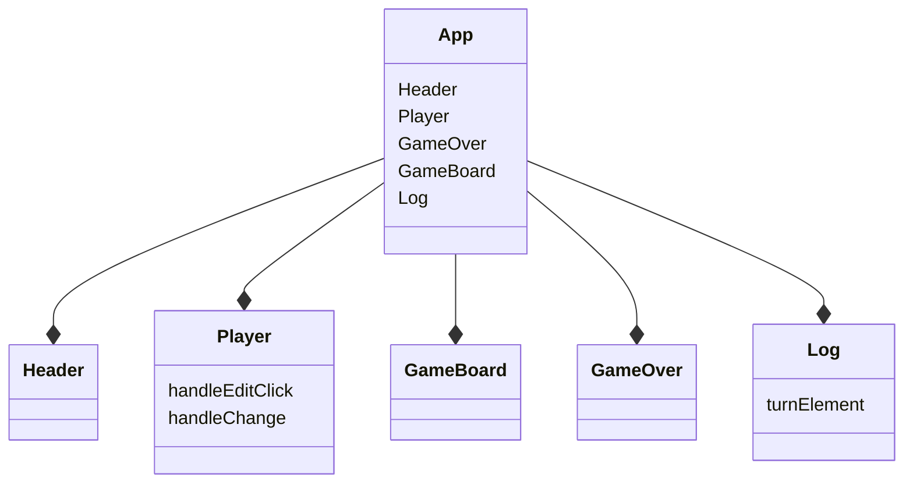

# Tic-Tac-Toe

This is a full tic tac toe game, created with React.


### Installation

```
npm install
```

### Run the game

```
npm run dev
```

### Component based structure



### AI

A simple AI mechanism with easy difficulty to allow players to win.


### Game Mechanism

1. The player (X) will start first.
2. Any time, player may change his name.
3. Player (0) is the AI and he will start after (X).
4. Each turn, a `checkWinner`method will trigger. It will check for a winner or a tie.
5. Rematch is available the game is over.
6. A full log will represents teach player movement on the game board.


Have Fun!!!